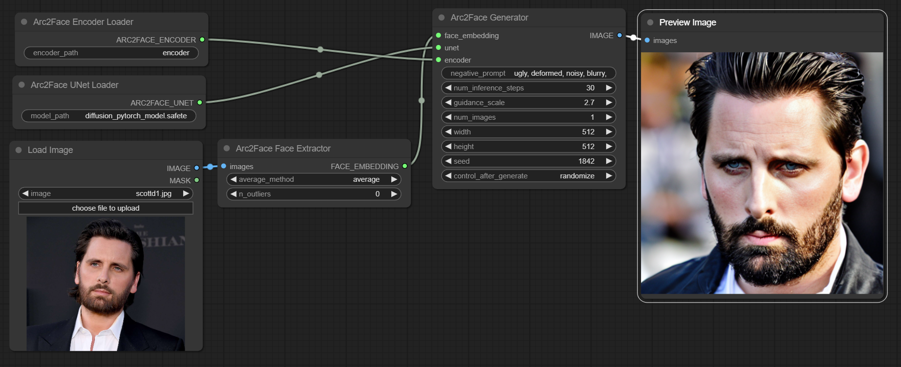
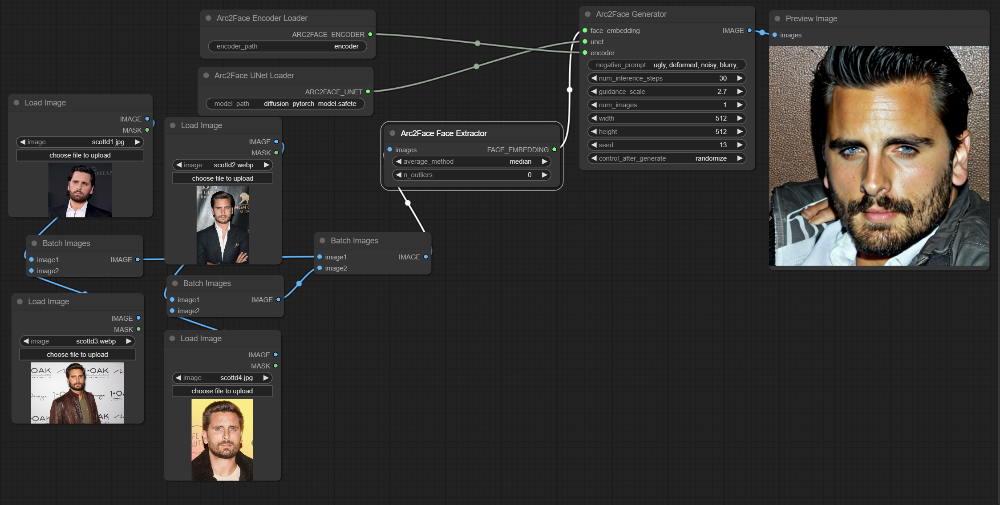
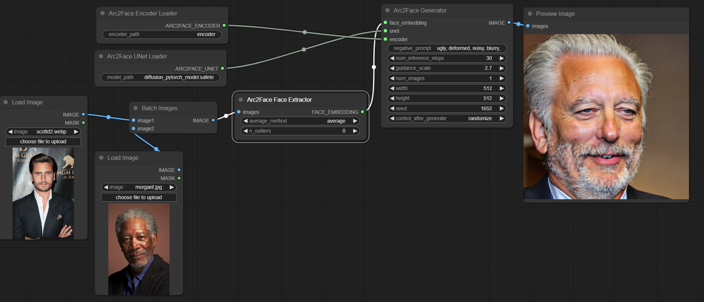
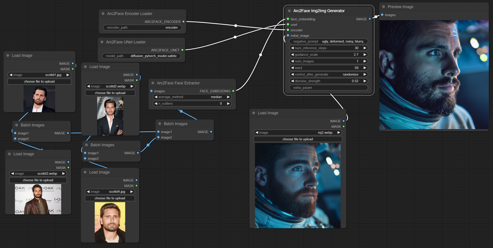

# Arc2Face ComfyUI Node Library

This ComfyUI node library builds upon the work done to train the [Arc2Face](https://github.com/foivospar/Arc2Face) model by foivospar. It provides a set of nodes for ComfyUI that allow users to extract face embeddings, generate images based on these embeddings, and perform image-to-image transformations.

## Features

- Face embedding extraction from images
- Multiple methods for averaging face embeddings
- Image generation based on face embeddings
- Image-to-image transformation with face embeddings
- Image grid generation for easy comparison

## Installation

1. Clone this repository into your ComfyUI `custom_nodes` directory:

   ```
   cd /path/to/ComfyUI/custom_nodes
   git clone https://github.com/your-username/arc2face-comfyui.git
   ```

2. Install the required dependencies:

   ```
   pip install -r requirements.txt
   ```

3. Download the necessary model files (see the "Model Files" section below).

## Model Files

To use this node library, you need to download the following files and place them in your ComfyUI models folder with the structure shown below:

1. From [camenduru/Arc2Face on Hugging Face](https://huggingface.co/camenduru/Arc2Face/), download:

   - `scrfd_10g_bnkps.onnx`
   - `arcface.onnx`

2. From [FoivosPar/Arc2Face on Hugging Face](https://huggingface.co/FoivosPar/Arc2Face/tree/main), download:
   - `arc2face/config.json`
   - `arc2face/diffusion_pytorch_model.safetensors`
   - `encoder/config.json`
   - `encoder/pytorch_model.bin`

Place these files in your ComfyUI models folder with the following structure:

```
ComfyUI/
└── models/
    ├── antelopev2/
    │   ├── scrfd_10g_bnkps.onnx
    │   └── arcface.onnx
    └── arc2face_checkpoints/
        ├── config.json
        ├── diffusion_pytorch_model.safetensors
        └── encoder/
            ├── config.json
            └── pytorch_model.bin
```

Ensure that you maintain this exact directory structure for the node library to function correctly.

## Usage

After installation and downloading the model files, you'll find the following nodes available in ComfyUI:

1. Arc2Face Face Extractor
   - Extracts all faces from a single input image (have tested as many as 64), averages them using the selected averaging scheme, and outputs the embedding the generators expect. Use the grid generator below for easy directory load.
2. Arc2Face UNet Loader
   - load the arc2face model itself
3. Arc2Face Encoder Loader
   - load the encoder model
4. Arc2Face Generator
   - take in embedding and output images
5. Arc2Face Img2Img Generator
   - take in embedding, init image, and denoise and perform img2img
6. Arc2Face Image Grid Generator
   - take in directory path, load all images, append them into 1 single large grid image to easily pass to face extractor

You can use these nodes to create workflows for face-based image generation and transformation in ComfyUI.

## Examples

find the json workflows for these in the examples folder.

### Simplest usage



### Multiple faces (tends to have better results)



### Face Mixing



### Img2Img



## Tips

- Averaging methods if passing multiple faces mess with how the facial embeds are combined. In my experience median is best for a few inputs, and ensemble can be good for many.
- n_outliers on the face extractor node removes the n faces farthest from the cluster. This can be useful if you know there are some background faces being caught that aren't your character, as their face should be quite different than most.
- I didn't create an inpainting node, but you can effectively inpaint the face automatically with some [Face Analysis](https://github.com/cubiq/ComfyUI_FaceAnalysis) nodes, see [Latent Vision's video](https://www.youtube.com/watch?v=UTmwyxHQ7pM)

## TODO

- It'd be nice to support the controlnet that is trained on this, but the required preprocessor looks difficult to install/work with - I may work on that eventually or test to see if easier preprocessors can be made to work with the controlnet. If anyone is so inclined feel free to open a PR.
- would like to make the loader nodes download the files if they don't exist
- could probably collapse the 2 generators into 1, where you pass empty and 100 denoise for non img2img
- I can add a positive prompt, but in my testing, any positive prompt at all ruined outputs, as this is heavily finetuned on face embeddings only

## Disclaimer

By using this node, you agree to:

1. **Legal & Ethical Use**: Comply with all applicable laws and use this technology ethically.
2. **Consent**: Obtain consent from individuals before using their likeness.
3. **No Harmful Content**: Refrain from creating deepfakes, pornography, or content that harasses or defames others.
4. **Transparency**: Disclose when content has been altered using this technology.
5. **Intellectual Property**: Respect copyrights and other IP rights.
6. **No Impersonation**: Don't use for fraudulent impersonation.

**Note**: This node is provided "as is" without warranties. The creator is not liable for misuse or any consequences arising from its use.

By using this node, you acknowledge and agree to these terms. Use responsibly.

## Contributing

Contributions are welcome! Please feel free to submit a Pull Request.

## Acknowledgements

- Original Arc2Face model by [foivospar](https://github.com/foivospar/Arc2Face)
- Useful gradio demo by [camenduru](https://github.com/camenduru/Arc2Face-jupyter)
